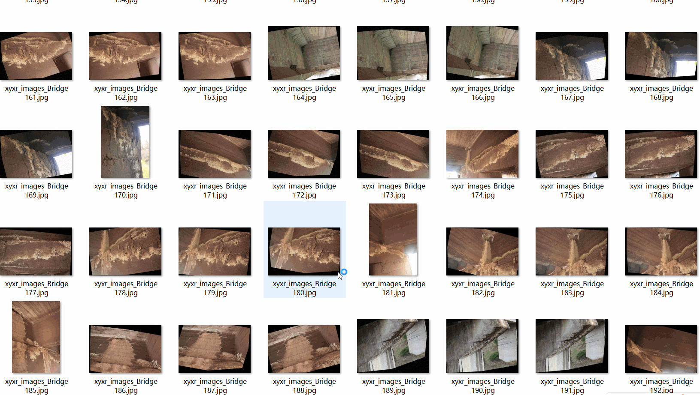
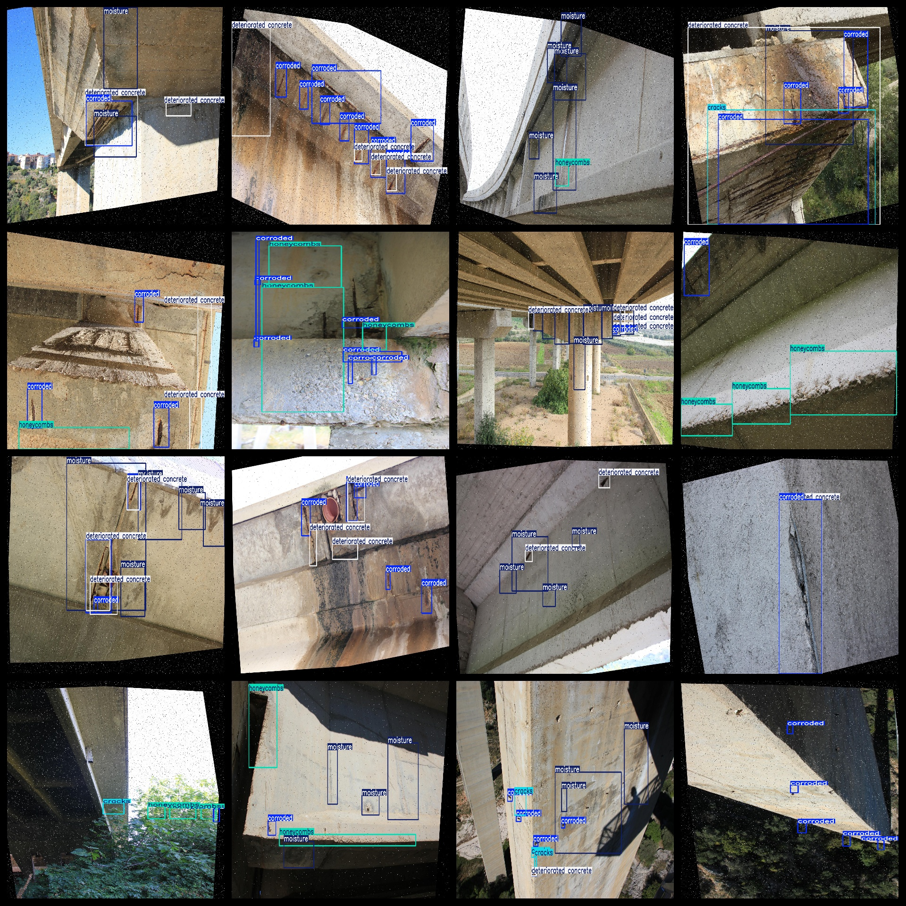

# Bridge Defect Detection Dataset: 6174 Images, 8-Class Defect, VOC+YOLO Format

Bridge Defect Detection Dataset contains 6174 images, 8 classes of defects. It is in VOC format and YOLO format. The dataset includes three folders: JPEGImages, Annotations, and labels.

In the JPEGImages folder, there are a total of 6174 JPEG images.

In the Annotations folder, there are a total of 6174 xml files.

In the labels folder, there are a total of 6174 txt files.

The number of label categories is 8.

The label names are ["corroded", "cracks", "deteriorated concrete", "honeycombs", "moisture", "pavement degradation", "shrinkage cracks", "shrinkage cracks_bass"].

The labels are [“Corrosion”，“Crack”，“Deterioration of Concrete”，“Hollow Damage”，“Moisture”，“Routing Degradation”，“Contraction Crack”，“Bottom Contraction Crack”].

The box numbers for each label (noting that the order of yolo format class is not consistent with this, but based on the classes.txt in the labels folder):

- corroded boxes = 22518
- cracks boxes = 3089
- deteriorated concrete boxes = 6862
- honeycombs boxes = 7727
- moisture boxes = 15058
- pavement degradation boxes = 77
- shrinkage cracks boxes = 171
- shrinkage cracks_bass boxes = 3

Total box numbers = 55505

The image clarity (resolution: pixels) is clear.

The images have been enhanced.

The shape of the labeled images is a rectangle box, used for target detection recognition.

Important Note: No guarantees are made regarding the accuracy or reasonableness of the labeled data by this dataset. The dataset only provides accurate and reasonable annotations.

Labeling and Image Information:
## Images

---

Here is a pay link on Stripe (https://buy.stripe.com/3cs8yP7sY87d0vu9AB). Please contact me lonlonago@foxmail.com after funding $89, and I will send you a complete data files, thank you!

